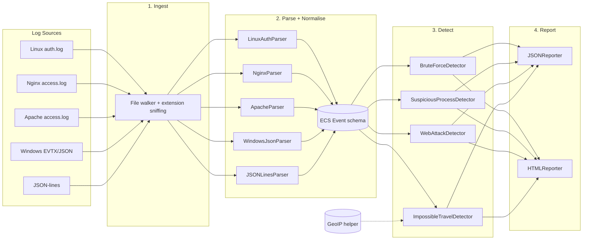

# PySOC — A Local-First Mini Security Operations Center

[](https://www.python.org/downloads/)
[](#how-i-validated-this)
[](LICENSE)
[](#how-i-validated-this)
[](docs/DETECTION_RULES.md)
[](pyproject.toml)

> **PySOC** is a lightweight, local-first detection engine that ingests
> heterogeneous log sources (Windows EVTX/JSON exports, Linux `auth.log`,
> Nginx/Apache access logs, JSON-lines), normalises every record into a
> single ECS-inspired schema, runs a pluggable rule-based detection engine,
> and emits both a machine-readable JSON report and a self-contained static
> HTML dashboard.

PySOC was built to demonstrate professional software-engineering practices
**and** practical detection-engineering judgement — Test-Driven Development,
modular architecture, OWASP-aligned detection content, SANS-style
threat-hunting reporting, and an explicit false-positive handling strategy.

---

## Table of Contents

1. [Why PySOC? (Issues It Solves)](#why-pysoc-issues-it-solves)
2. [What PySOC Catches](#what-pysoc-catches)
3. [Architecture](#architecture)
4. [Installation](#installation)
5. [Usage](#usage)
6. [How I Validated This](#how-i-validated-this)
7. [False-Positive Handling](#false-positive-handling)
8. [Repository Layout](#repository-layout)
9. [Documentation](#documentation)
10. [Roadmap](#roadmap)
11. [Contributing](#contributing)
12. [License](#license)

---

## Why PySOC? (Issues It Solves)

Small and mid-size security teams face a recurring set of problems that
commercial SIEMs either over-engineer or ignore entirely:

| Problem | How PySOC addresses it |
|---|---|
| **Vendor lock-in** — most SIEMs require their own agent, their own query language, their own dashboard format. | PySOC reads **plain files** (`.log`, `.json`, `.jsonl`) and emits **open formats** (JSON + static HTML). No agent, no proprietary language. |
| **Cost** — per-GB-per-day pricing pushes teams to under-collect logs. | PySOC runs on a $5 VM against locally-stored logs. Zero runtime dependencies; trivially portable to air-gapped environments. |
| **Opaque detection logic** — vendor rules are hidden in a UI; you cannot read them. | Every PySOC rule is plain Python with comments, MITRE ATT&CK mappings, and a documented false-positive strategy. See [`docs/DETECTION_RULES.md`](docs/DETECTION_RULES.md). |
| **Test-free detection content** — vendor rules ship without tests; you cannot tell if they still work after a content upgrade. | Every detector ships with unit tests AND integration tests that prove it fires against realistic mock data. See [`tests/`](tests/) and the [`How I Validated This`](#how-i-validated-this) section. |
| **Format sprawl** — Windows EVTX, Linux syslog, Nginx combined, Apache combined, custom JSON — every source speaks a different dialect. | PySOC normalises every record into a single ECS-inspired schema in one place (`src/pysoc/models.py`) so detectors never need to know about log format. |
| **No FP strategy** — detectors fire, alert queue floods, analysts burn out. | Every detector carries an explicit `note` field describing common false positives and how to triage them. See [`docs/FALSE_POSITIVES.md`](docs/FALSE_POSITIVES.md). |
| **No demo data** — "show me it works" becomes a 30-minute screen-share. | PySOC ships with a deterministic synthetic-log generator (`data/generator/generate_logs.py`) that produces malicious AND benign traffic, so a recruiter can run `make demo` and see real alerts in 5 seconds. |

---

## What PySOC Catches

PySOC ships with four production-grade detection rules out of the box:

| Rule ID | Name | Source | MITRE ATT&CK | Severity | What it catches |
|---|---|---|---|---|---|
| **BF-001** | Brute-force login (SSH/Windows) | Linux `auth.log`, Windows 4624/4625 | T1110 | HIGH | ≥ N failed logins for the same user from the same IP within a sliding window. |
| **SP-001** | Suspicious process execution | Windows 4688 | T1059.001, T1003, T1218, T1204 | HIGH/CRITICAL | Encoded PowerShell, download cradles, mimikatz, procdump, suspicious parent→child (Office→PowerShell), certutil LOLBin. |
| **WA-001** | Web attack patterns (OWASP Top-10) | Nginx / Apache access logs | T1190, T1059.007, T1083 | HIGH/CRITICAL | SQLi (UNION, OR comment, sleep), XSS (script tag, event handler, javascript: URI), path traversal (`../`, encoded `/etc/passwd`), command injection, SSRF probes (cloud metadata endpoint), RFI. |
| **IT-001** | Impossible travel (geo-velocity) | Any successful login | T1078 | MEDIUM | Same user logs in from two countries whose distance cannot be physically traversed in the elapsed time (default: implied speed > 900 km/h). |

Each rule is documented in depth in [`docs/DETECTION_RULES.md`](docs/DETECTION_RULES.md).

---

## Architecture

PySOC is structured as a classic four-stage pipeline:
**ingest → parse → detect → report**.



### Design principles

1. **Stateless parsers, stateful detectors.** A parser must produce the same
   `Event` stream every time it sees the same input. Detectors may keep
   state *within a single `analyze()` call* but must be deterministic.
2. **Immutable models.** `Event` and `Alert` are `frozen=True` dataclasses —
   no detector can mutate an event in flight.
3. **Zero runtime dependencies.** Only the Python standard library is
   required. This keeps the install footprint tiny and makes PySOC
   trivially portable to air-gapped environments.
4. **ECS-inspired schema.** The `Event` dataclass is a pragmatic subset of
   the Elastic Common Schema; adding new fields is backward-compatible
   because every field has a default.
5. **Pluggable detectors.** Each detector is a small class that inherits
   from `BaseDetector` and implements `analyze(events)`. New rules can be
   added in <50 lines of code; the pipeline picks them up automatically.

---

## Installation

PySOC runs on **Python 3.10+** and has **zero runtime dependencies**.

### From source (recommended for this repo)

```bash
git clone <repo-url>
cd pysoc

# Create a virtual environment (optional but recommended)
python -m venv .venv
source .venv/bin/activate    # Linux/macOS
# .venv\Scripts\activate     # Windows

# Install PySOC in editable mode + dev dependencies
pip install -e ".[dev]"
```

### Verify the install

```bash
pytest                       # 80 tests should pass
python -m pysoc list-rules   # Print all registered detection rules
```

---

## Usage

### Quickstart (5 seconds to first alert)

```bash
# 1. Generate synthetic mock logs (5 files in data/raw/)
python -m pysoc generate --out data/raw

# 2. Run the full pipeline against all generated files
python -m pysoc run data/raw/auth.log data/raw/nginx_access.log \
                          data/raw/apache_access.log \
                          data/raw/windows_events.json \
                          data/raw/impossible_travel.jsonl \
    --json-out data/output/report.json \
    --html-out data/output/report.html

# 3. Open the HTML dashboard in your browser
open data/output/report.html    # macOS
xdg-open data/output/report.html  # Linux
```

Expected output (abbreviated):

```
PySOC run complete.
  Events analysed : 86
  Alerts raised   : 30
    high     : 28
    medium   : 1
    critical : 1
  JSON report : data/output/report.json
  HTML report : data/output/report.html
```

### Run against real logs

```bash
# Linux SSH brute-force detection
python -m pysoc run /var/log/auth.log --json-out report.json

# Nginx web-attack detection
python -m pysoc run /var/log/nginx/access.log --html-out dashboard.html

# Windows events (after exporting with Get-WinEvent | ConvertTo-Json)
python -m pysoc run windows_events.json

# Force a specific parser if auto-detection fails
python -m pysoc run weird-named-file.xyz --parser nginx
```

### Use PySOC as a library

```python
from pysoc import run_pipeline

result = run_pipeline(
    ["data/raw/auth.log", "data/raw/nginx_access.log"],
    json_out="report.json",
    html_out="report.html",
)

for alert in result["alerts"]:
    print(f"[{alert.severity.value:>8}] {alert.rule_id}  {alert.description}")
```

See [`examples/`](examples/) for more.

### Makefile shortcuts

```bash
make install     # pip install -e ".[dev]"
make test        # pytest -v
make demo        # generate data + run pipeline + open dashboard
make lint        # ruff / flake8 (if installed)
make clean       # remove build artefacts and generated data
```

---

## How I Validated This

PySOC was developed strictly under **Test-Driven Development (TDD)**: tests
were written *before* the implementation, and the implementation was
iterated until every test passed. The validation strategy has three layers:

### Layer 1 — Unit tests (65 tests)

Located in [`tests/unit/`](tests/unit/). Each unit test exercises a single
class or function in isolation, with hand-crafted in-memory `Event`
fixtures. Examples:

- `test_detect_brute_force.py` — Verifies the sliding-window logic fires
  above threshold, does not fire below, and separates bursts by user/IP.
- `test_detect_suspicious_process.py` — Verifies encoded-PowerShell
  decoding, mimikatz detection, certutil LOLBin, and Word→PowerShell
  parent/child detection.
- `test_detect_web_attacks.py` — Verifies SQLi, XSS, path-traversal, SSRF
  patterns; verifies multiple-family matches bump severity.
- `test_detect_impossible_travel.py` — Verifies geo-velocity calculation,
  same-country suppression, and internal-IP filtering.
- `test_parsers.py` — One happy-path test + one negative test per parser.
- `test_models.py` — Verifies `Event` immutability, fingerprint stability,
  and the `Severity` ordering.

### Layer 2 — Integration tests (10 tests)

Located in [`tests/integration/`](tests/integration/). The end-to-end test
(`test_end_to_end.py`) does the following:

1. Invokes the data generator as a subprocess to produce 5 mock log files.
2. Runs the full PySOC pipeline (`run_pipeline`) against all 5 files.
3. Asserts that **every rule fires at least once** (BF-001, SP-001, WA-001,
   IT-001) — i.e. the synthetic attacks are actually caught.
4. Asserts that the JSON and HTML reports are written and well-formed.
5. Asserts the pipeline is **idempotent** — running twice produces the
   same alert count.

### Layer 3 — Synthetic data generator

Located in [`data/generator/generate_logs.py`](data/generator/generate_logs.py).
Produces deterministic, **harmless** mock data (no executable code is ever
generated — only log lines and JSON records). The generator simulates:

- SSH brute-force (8 failures for `root` from `203.0.113.5` + a successful
  credential-stuffing follow-up).
- Web SQLi, XSS, path traversal, SSRF, command injection probes.
- Windows 4625 brute-force against `Administrator`.
- Encoded PowerShell (`-EncodedCommand` with a base64 payload that
  decodes to `Write-Host 'pysoc-test: harmless encoded payload'`).
- Mimikatz invocation.
- Word → PowerShell macro-malware pattern.
- Impossible travel (alice logs in from US at 14:00, from CN at 14:30).

### Running the validation yourself

```bash
# Full validation: 80 tests in <1 second
pytest -v

# With coverage report
pytest --cov=pysoc --cov-report=term-missing

# Just the end-to-end integration tests
pytest tests/integration -v
```

Sample output:

```
============================= test session starts ==============================
platform linux -- Python 3.12.13, pytest-9.0.2
collected 80 items

tests/integration/test_data_generator.py ...                             [  3%]
tests/integration/test_end_to_end.py ........                           [ 13%]
tests/unit/test_detect_brute_force.py ......                            [ 21%]
tests/unit/test_detect_impossible_travel.py ......                      [ 28%]
tests/unit/test_detect_suspicious_process.py .......                    [ 37%]
tests/unit/test_detect_web_attacks.py .........                         [ 48%]
tests/unit/test_ingest.py ........                                      [ 58%]
tests/unit/test_models.py ..........                                    [ 71%]
tests/unit/test_parsers.py ..................                           [ 93%]
tests/unit/test_report.py .....                                         [100%]

============================== 80 passed in 0.47s ==============================
```

---

## False-Positive Handling

Every PySOC detector carries an explicit `note` field in its alert context
describing the most common false positives and how to triage them. The full
strategy is documented in [`docs/FALSE_POSITIVES.md`](docs/FALSE_POSITIVES.md).

| Rule | Common false positives | PySOC's strategy |
|---|---|---|
| **BF-001** | Load-balancer health checks using wrong credentials; scripts retrying with expired passwords. | Emit the alert with a `note` field; analyst correlates with subsequent successful login from same IP. |
| **SP-001** | Legitimate admin use of encoded PowerShell; signed vendor installers spawning PowerShell. | Decode the payload and include it in the alert context; analyst can immediately judge intent. |
| **WA-001** | Security scanners (Nessus, Burp); aggressive WAF probes. | Include source IP, User-Agent, and full URL; analyst can whitelist known scanner IPs. |
| **IT-001** | Corporate VPN egressing through multiple POPs; mobile device switching between cell and Wi-Fi. | Emit the alert with implied speed; analyst correlates with MFA challenge response. |

PySOC also publishes **estimated true-positive rate priors** per rule in
every report (see `summary.true_positive_estimates` in the JSON output).
These are documented priors derived from public incident-response data,
not measured from the current run.

---

## Repository Layout

```
pysoc/
├── README.md                   # This file
├── LICENSE                     # MIT
├── CONTRIBUTING.md             # How to contribute
├── CODE_OF_CONDUCT.md          # Contributor Covenant
├── SECURITY.md                 # Vulnerability disclosure
├── CHANGELOG.md                # Semantic versioning changelog
├── pyproject.toml              # PEP 621 project metadata + pytest config
├── requirements.txt            # Pinned dev requirements (for CI)
├── requirements-dev.txt        # Pinned dev requirements
├── Makefile                    # install / test / demo / lint / clean
├── .gitignore
├── .env.example
├── .github/
│   └── workflows/
│       └── ci.yml              # GitHub Actions: pytest on push/PR
├── docs/
│   ├── ARCHITECTURE.md         # Deep-dive on the pipeline design
│   ├── DETECTION_RULES.md      # Per-rule documentation
│   ├── FALSE_POSITIVES.md      # FP handling strategy
│   ├── ROADMAP.md              # What's next
│   └── DEVELOPMENT.md          # How to add a new detector
├── data/
│   ├── generator/
│   │   ├── __init__.py
│   │   ├── generate_logs.py    # Synthetic mock-log generator
│   │   └── README.md
│   ├── raw/                    # Generated logs (gitignored)
│   ├── sample/                 # Committed sample inputs
│   └── output/                 # Generated reports (gitignored)
├── examples/
│   ├── run_pysoc.py            # Library usage example
│   └── custom_rule.py          # How to add a custom detector
├── screenshots/
│   └── README.md               # How to regenerate dashboard screenshots
├── scripts/
│   ├── scaffold.py             # Create the directory structure
│   └── run_all.sh              # End-to-end demo script
├── src/
│   └── pysoc/
│       ├── __init__.py
│       ├── __main__.py         # python -m pysoc
│       ├── cli.py              # Argparse CLI
│       ├── models.py           # Event / Alert / Severity (ECS-inspired)
│       ├── geo.py              # Pseudo-GeoIP + haversine
│       ├── ingest.py           # File walker + parser dispatch
│       ├── pipeline.py         # run_pipeline() orchestrator
│       ├── parsers/
│       │   ├── __init__.py     # Registry
│       │   ├── base.py
│       │   ├── linux_auth.py
│       │   ├── nginx.py
│       │   ├── apache.py
│       │   ├── json_parser.py
│       │   └── windows_json.py
│       ├── detect/
│       │   ├── __init__.py     # Registry
│       │   ├── base.py
│       │   ├── brute_force.py
│       │   ├── suspicious_process.py
│       │   ├── web_attacks.py
│       │   └── impossible_travel.py
│       └── report/
│           ├── __init__.py
│           ├── base.py
│           ├── json_reporter.py
│           └── html_reporter.py
└── tests/
    ├── conftest.py             # Shared fixtures
    ├── unit/
    │   ├── test_parsers.py
    │   ├── test_models.py
    │   ├── test_ingest.py
    │   ├── test_detect_brute_force.py
    │   ├── test_detect_suspicious_process.py
    │   ├── test_detect_web_attacks.py
    │   ├── test_detect_impossible_travel.py
    │   └── test_report.py
    └── integration/
        ├── test_data_generator.py
        └── test_end_to_end.py
```

---

## Documentation

| Document | What's inside |
|---|---|
| [`docs/ARCHITECTURE.md`](docs/ARCHITECTURE.md) | Deep-dive on the four-stage pipeline, schema design, and detector model. |
| [`docs/DETECTION_RULES.md`](docs/DETECTION_RULES.md) | Per-rule reference: trigger, MITRE ATT&CK mapping, sample alert, tuning knobs. |
| [`docs/FALSE_POSITIVES.md`](docs/FALSE_POSITIVES.md) | FP strategy per rule, with concrete triage playbooks. |
| [`docs/ROADMAP.md`](docs/ROADMAP.md) | What's next: Sigma-rule import, MaxMind GeoLite2, ECS parity, Kafka ingest, … |
| [`docs/DEVELOPMENT.md`](docs/DEVELOPMENT.md) | How to add a new detector in <50 lines (TDD recipe). |

---

## Roadmap

PySOC is intentionally scoped; the goal is a polished, well-tested
foundation — not feature-parity with Splunk. See [`docs/ROADMAP.md`](docs/ROADMAP.md)
for the full list. Highlights:

- **Sigma-rule import** — load detection rules from the open Sigma format.
- **Real GeoLite2** — replace the synthetic geo map with MaxMind's GeoLite2.
- **Live tail mode** — `python -m pysoc tail /var/log/auth.log` for real-time detection.
- **Stream correlation** — sliding-window correlator for multi-stage attacks.
- **ECS parity** — expand `Event` to a fuller ECS subset for interop with
  Elastic / OpenSearch.
- **EVTX native reader** — `python-evtx` integration for reading `.evtx`
  files directly (no PowerShell pre-export).
- **Threat-intel enrichment** — Virustotal / AbuseIPDB lookups on source IPs.
- **Webhook alerting** — POST alerts to Slack / MS Teams / Discord.

---

## Contributing

Contributions are welcome! Please read [`CONTRIBUTING.md`](CONTRIBUTING.md)
and [`CODE_OF_CONDUCT.md`](CODE_OF_CONDUCT.md) before opening a pull
request. The short version:

1. Open an issue first to discuss the change.
2. Follow TDD: write the test, then the implementation.
3. All tests must pass: `pytest`.
4. Add a changelog entry in [`CHANGELOG.md`](CHANGELOG.md).
5. Keep the runtime dependency list at zero (or open an issue to discuss
   why a new dependency is justified).

---

## License

MIT — see [`LICENSE`](LICENSE).
